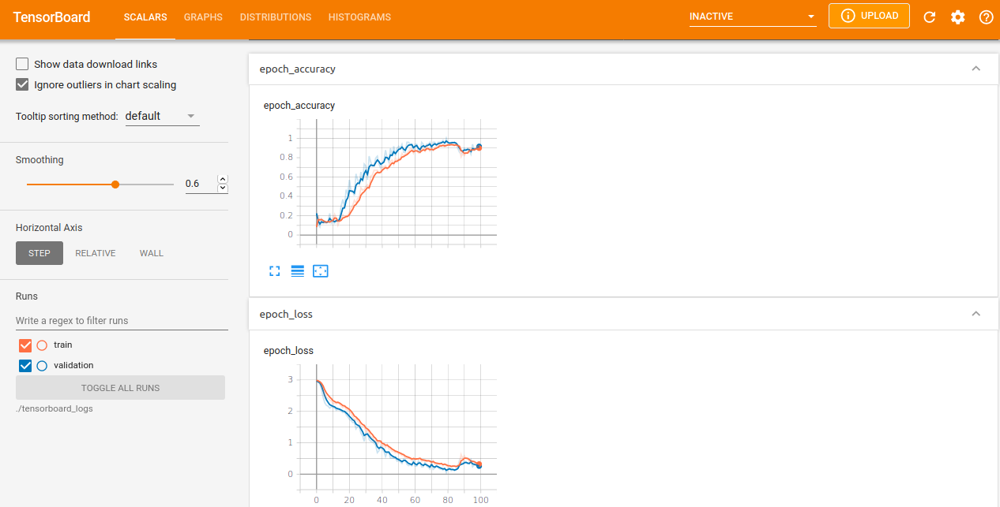

1. python3 build_arg_one_dataset.py -p=/home/user/nr_test/ -s=/home/user/nr_save_dir/ -w=/home/user/nr_work_dir/

2. python3 build_ret_type__vocab_seq_len.py -s=/home/user/nr_save_dir/

3. python3 build_balanced_dataset.py -s=/home/user/nr_save_dir/

4. python3 transform_ret_type_to_int.py -s=/home/user/nr_save_dir/

4. python3 train_arg_one_model_lstm.py -s=/home/user/nr_save_dir/ -m=/home/user/nr_save_dir/tfrecord/ -r=/home/user/nr_save_dir/tfrecord/ -v=/home/user/nr_save_dir/tfrecord/

5. python3 predict_with_trained_model.py -c=/home/user/nr_save_dir/tensorboard_logs/

Epoch 97/100
3/3 [==============================] - 1s 217ms/step - loss: 0.3789 - accuracy: 0.8856 - val_loss: 0.2986 - val_accuracy: 0.8776
Epoch 98/100
3/3 [==============================] - 1s 198ms/step - loss: 0.3325 - accuracy: 0.8935 - val_loss: 0.2816 - val_accuracy: 0.8980
Epoch 99/100
3/3 [==============================] - 1s 218ms/step - loss: 0.3253 - accuracy: 0.8998 - val_loss: 0.2542 - val_accuracy: 0.9184
Epoch 100/100
3/3 [==============================] - 1s 211ms/step - loss: 0.2836 - accuracy: 0.9131 - val_loss: 0.2230 - val_accuracy: 0.9388
1/1 [==============================] - 0s 190ms/step - loss: 0.1398 - accuracy: 0.9574
Loss:  0.13980624079704285
Accuracy:  0.957446813583374
Saving trained word embeddings (meta.tsv,vecs.tsv)             (usable in tensorboard->Projector, use chromium-browser to see it correctly,firefox does not always wor
k)
10 vocab words >['', '[UNK]', '%', 'null', ',', 'x', '1', 'mov', ')', '(']<
Building vectors.tsv file, use tensorboard->projector with chromium-browser
Building metadata.tsv file, use tensorboard->projector with chromium-browser

