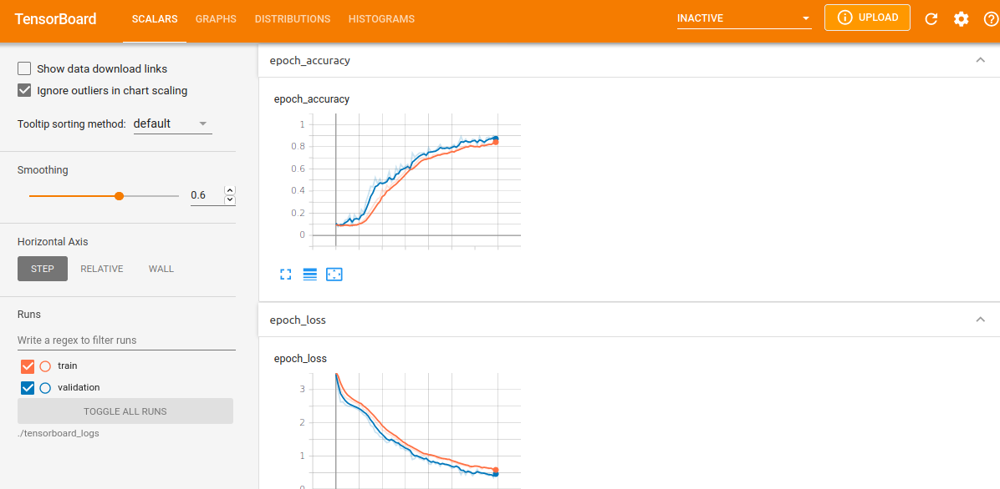

Dont forget / after paths

1. python3 build_caller_callee_dataset.py -p=/home/user/test -s=/home/user/save_dir/ -w=/home/user/work_dir/

2. python3 build_ret_type__vocab__seq_len.py -s=/home/user/save_dir/

3. python3 transform_ret_type_to_int.py -s=/home/user/save_dir/

4. python3 split_dataset_to_train_val_test.py -s=/home/user/save_dir/

### train with balanced dataset
1. python3 build_caller_callee_dataset.py -p=/home/user/test -s=/home/user/save_dir/ -w=/home/user/work_dir/

2. python3 build_ret_type__vocab__seq_len.py -s=/home/user/save_dir/

3. python3 build_balanced_dataset.py -s=/home/user/save_dir/

4. python3 transform_ret_type_to_int.py -s=/home/user/save_dir/balanced/ -f=/home/user/save_dir/tfrecord/ -r=/home/user/save_dir/tfrecord/return_type_dict.pickle -m=/home/user/save_dir/tfrecord/max_seq_length.pickle -v=/home/user/save_dir/tfrecord/vocabulary_list.pickle

5. Dont split dataset (remove train/test/val dir in tfrecord dir, if exist)

##modify path in file till now
5. python3 train_caller_callee_model.py -s=/home/user/save_dir/

# Run with n1-standard-16(16vCPUs,60GB RAM)  8xV100 Tesla GPU
Adapting to TextVectorization takes ~1hour-15minutes

18336/18336 [==============================] - 6410s 350ms/step - loss: 1.8419 - accuracy: 0.4254 - val_loss: 1.9861 - val_accuracy: 0.3827
Epoch 2/2
18336/18336 [==============================] - 6301s 344ms/step - loss: 1.7016 - accuracy: 0.4575 - val_loss: 1.9310 - val_accuracy: 0.3680
2087/2087 [==============================] - 251s 121ms/step - loss: 1.7852 - accuracy: 0.4545
Loss:  1.785247802734375
Accuracy:  0.4544600546360016
Saving trained word embeddings (meta.tsv,vecs.tsv) (usable in tensorboard->Projector)
10 vocab words >['', '[UNK]', '%', 'null', ',', 'x', '1', '(', ')', 'mov']<
Shape of the weigths >(1464, 8)<

## run with balanced dataset
Epoch 65/70
8/8 [==============================] - 1s 171ms/step - loss: 0.6529 - accuracy: 0.8142 - val_loss: 0.4815 - val_accuracy: 0.8204
Epoch 66/70
8/8 [==============================] - 1s 171ms/step - loss: 0.6731 - accuracy: 0.8091 - val_loss: 0.4308 - val_accuracy: 0.8802
Epoch 67/70
8/8 [==============================] - 1s 171ms/step - loss: 0.6122 - accuracy: 0.8299 - val_loss: 0.4139 - val_accuracy: 0.8862
Epoch 68/70
8/8 [==============================] - 1s 170ms/step - loss: 0.6227 - accuracy: 0.8352 - val_loss: 0.4392 - val_accuracy: 0.8743
Epoch 69/70
8/8 [==============================] - 1s 171ms/step - loss: 0.5487 - accuracy: 0.8544 - val_loss: 0.3485 - val_accuracy: 0.8982
WARNING:absl:Found untraced functions such as forward_lstm_layer_call_fn, forward_lstm_layer_call_and_return_conditional_losses, backward_lstm_layer_call_fn, backward
_lstm_layer_call_and_return_conditional_losses, forward_lstm_1_layer_call_fn while saving (showing 5 of 40). These functions will not be directly callable after loadi
ng.
Epoch 70/70
8/8 [==============================] - 1s 171ms/step - loss: 0.5683 - accuracy: 0.8518 - val_loss: 0.5517 - val_accuracy: 0.8563
WARNING:absl:Found untraced functions such as forward_lstm_layer_call_fn, forward_lstm_layer_call_and_return_conditional_losses, backward_lstm_layer_call_fn, backward
_lstm_layer_call_and_return_conditional_losses, forward_lstm_1_layer_call_fn while saving (showing 5 of 40). These functions will not be directly callable after loadi
ng.
2/2 [==============================] - 0s 53ms/step - loss: 0.4126 - accuracy: 0.8598
Loss:  0.41262561082839966
Accuracy:  0.8597561120986938
Saving trained word embeddings (meta.tsv,vecs.tsv)             (usable in tensorboard->Projector, use chromium-browser to see it correctly,firefox does not always wor
k)
10 vocab words >['', '[UNK]', '%', 'null', ',', 'x', 'mov', '1', ')', '(']<
Building vectors.tsv file, use tensorboard->projector with chromium-browser
Building metadata.tsv file, use tensorboard->projector with chromium-browser

