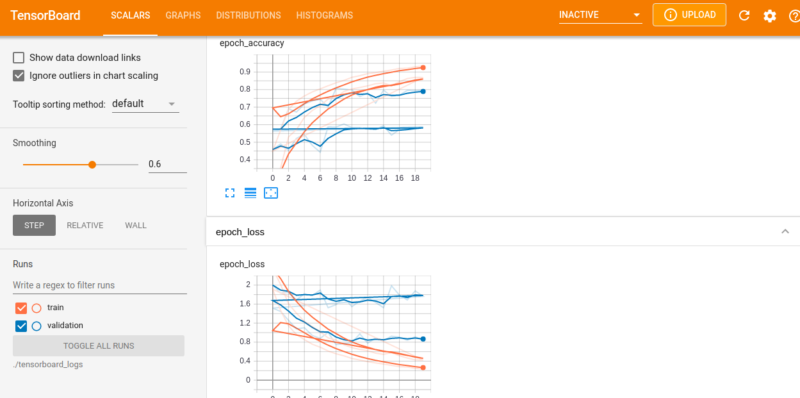

Dont forget / after paths

1. python3 build_caller_callee_dataset.py -p=/home/user/test -s=/home/user/save_dir/ -w=/home/user/work_dir/

2. python3 build_ret_type__vocab__seq_len.py -s=/home/user/save_dir/

3. python3 transform_ret_type_to_int.py -s=/home/user/save_dir/

4. python3 split_dataset_to_train_val_test.py -s=/home/user/save_dir/

### build balanced dataset
1. python3 build_caller_callee_dataset.py -p=/home/user/test -s=/home/user/save_dir/ -w=/home/user/work_dir/

2. python3 build_ret_type__vocab__seq_len.py -s=/home/user/save_dir/

3. python3 build_balanced_dataset.py -s=/home/user/save_dir/

4. python3 transform_ret_type_to_int.py -s=/home/user/save_dir/balanced/ -f=/home/user/save_dir/tfrecord/ -r=/home/user/save_dir/tfrecord/return_type_dict.pickle -m=/home/user/save_dir/tfrecord/max_seq_length.pickle -v=/home/user/save_dir/tfrecord/vocabulary_list.pickle

5. python3 split_dataset_to_train_val_test.py -s=/home/user/save_dir/

##modify path in file till now
5. train_caller_callee_model.py -s=/home/user/save_dir/

# Run with n1-standard-16(16vCPUs,60GB RAM)  8xV100 Tesla GPU
Adapting to TextVectorization takes ~1hour-15minutes

18336/18336 [==============================] - 6410s 350ms/step - loss: 1.8419 - accuracy: 0.4254 - val_loss: 1.9861 - val_accuracy: 0.3827
Epoch 2/2
18336/18336 [==============================] - 6301s 344ms/step - loss: 1.7016 - accuracy: 0.4575 - val_loss: 1.9310 - val_accuracy: 0.3680
2087/2087 [==============================] - 251s 121ms/step - loss: 1.7852 - accuracy: 0.4545
Loss:  1.785247802734375
Accuracy:  0.4544600546360016
Saving trained word embeddings (meta.tsv,vecs.tsv) (usable in tensorboard->Projector)
10 vocab words >['', '[UNK]', '%', 'null', ',', 'x', '1', '(', ')', 'mov']<
Shape of the weigths >(1464, 8)<

