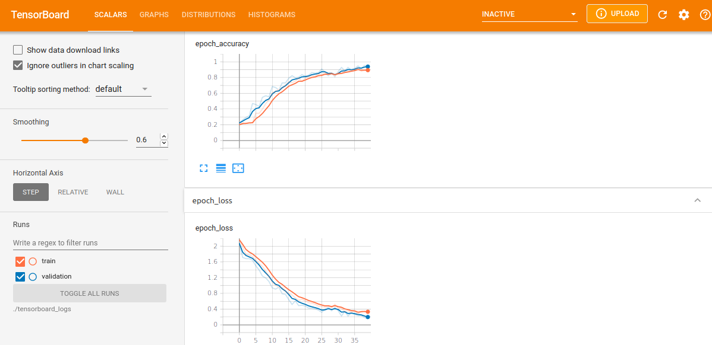

1. python3 build_nr_of_args_dataset.py -p=/home/user/nr_test/ -s=/home/user/nr_save_dir/ -w=/home/user/nr_work_dir/

2. python3 build_ret_type__vocab_seq_len.py -s=/home/user/nr_save_dir/

3. python3 build_balanced_dataset.py -s=/home/user/nr_save_dir/

4. python3 transform_ret_type_to_int.py -s=/home/user/nr_save_dir/

4. python3 train_nr_of_args_model_lstm.py -s=/home/user/nr_save_dir/ -m=/home/user/nr_save_dir/tfrecord/ -r=/home/user/nr_save_dir/tfrecord/ -v=/home/user/nr_save_dir/tfrecord/

Epoch 39/40
8/8 [==============================] - 1s 163ms/step - loss: 0.3191 - accuracy: 0.9047 - val_loss: 0.1858 - val_accuracy: 0.9542
Epoch 40/40
8/8 [==============================] - 1s 162ms/step - loss: 0.3405 - accuracy: 0.8764 - val_loss: 0.1587 - val_accuracy: 0.9477
2/2 [==============================] - 0s 53ms/step - loss: 0.2271 - accuracy: 0.9205
Loss:  0.22714632749557495
Accuracy:  0.9205297827720642
Saving trained word embeddings (meta.tsv,vecs.tsv)             (usable in tensorboard->Projector, use chromium-browser to see it correctly,firefox does not always wor
k)
10 vocab words >['', '[UNK]', '%', 'null', ',', 'x', '1', 'mov', ')', '(']<
Building vectors.tsv file, use tensorboard->projector with chromium-browser
Building metadata.tsv file, use tensorboard->projector with chromium-browser

