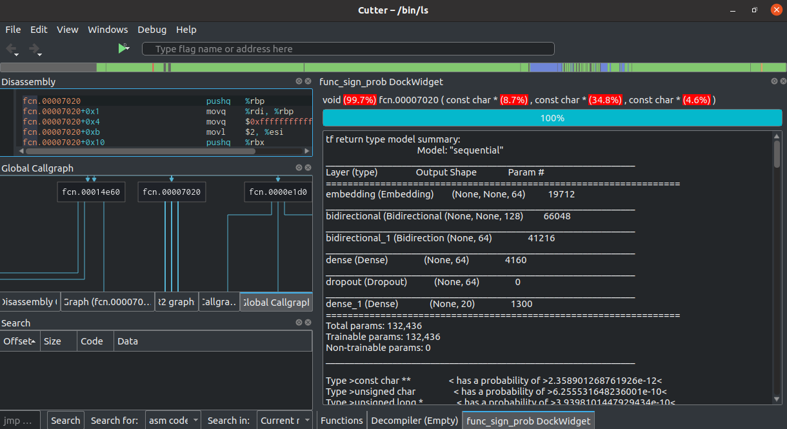

# Install

git clone into /home/user/git 

<pre><code>

ln -s /home/user/git/func_sign_prob/ubuntu-20-04-scripts/cutter_plugin/func_sign_prob_plugin.py  /home/user/.local/share/RadareOrg/Cutter/plugins/python/func_sign_prob_plugin.py

ln -s /home/user/git/func_sign_prob/ubuntu-20-04-scripts/lib/disassembly_lib.py /home/user/.local/share/RadareOrg/Cutter/plugins/python/disassembly_lib.py

ln -s /home/user/git/func_sign_prob/ubuntu-20-04-scripts/lib/pickle_lib.py /home/user/.local/share/RadareOrg/Cutter/plugins/python/pickle_lib.py

ln -s /home/user/git/func_sign_prob/ubuntu-20-04-scripts/cutter_plugin/cutter__init__.py /home/user/.local/share/RadareOrg/Cutter/plugins/python/func_sign_prob/__init__.py

</code></pre>

# Build Cutter from source
-->on ubuntu-20.04

Cutter appImage v1.12.0 includes no tensorflow, build from source 
https://cutter.re/docs/building.html

remove python2 if installed 
apt list --installed|grep python 
apt remove --purge python2.7 

if installed, remove pip3 installed stuff, use ubuntu-stuff 
pip3 uninstall pyside2 
pip3 uninstall shiboken2 

<pre><code>
sudo apt-get install python-is-python3 python3-pyside2.qtcore python3-pyside2.qtwidgets
python3-pyside2.qtqml libpyside2-dev libpyside2-py3-5.14 libshiboken2-dev libshiboken2-py3-5.14 shiboken2 qtdeclarative5-dev
</code></pre>

<pre><code>

cd /home/user/git/cutter

mkdir build

cd build

cmake -DCMAKE_EXE_LINKER_FLAGS="-Wl,--disable-new-dtags" -B build -DCUTTER_ENABLE_PYTHON=ON -DCUTTER_ENABLE_PYTHON_BINDINGS=ON -DCUTTER_USE_BUNDLED_RADARE2=ON  ../src/

cmake --build build

./build/Cutter

</code></pre>

// build on gcp with gpu ubuntu-image 20.04

<pre><code>

sudo apt install python3-pip shiboken2 python3-pyside2.qtwidgets python3-pyside2.qtqml libpyside2-dev libpyside2-py3-5.14 libshiboken2-dev libshiboken2-py3-5.14 shiboken2 libkf5syntaxhighlighting-dev python3-graphviz graphviz libgraphviz-dev python3-pkgconfig qtdeclarative5-dev python3-pyqt5 qt5-default python3-qtpy python3-clang

</code></pre>

