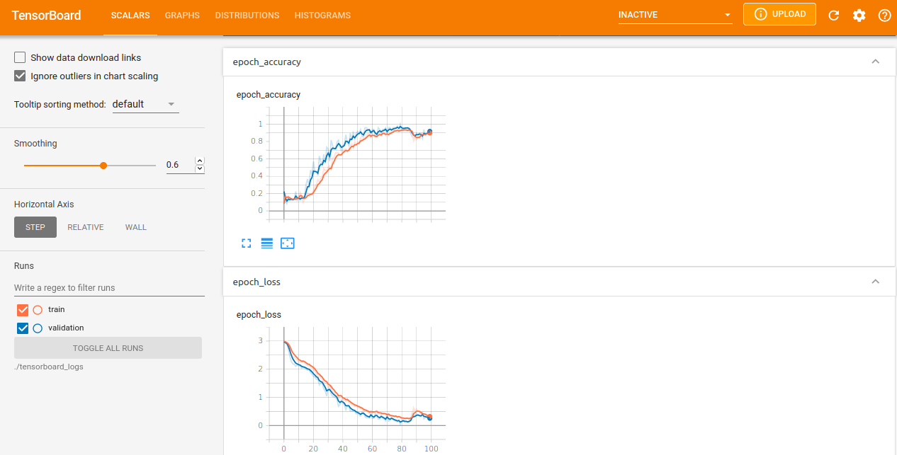

This model is trained with text=caller-callee-disassembly and label=function-argument-one

clone the rep into /home/user/git
 
Then run these commands, and you got a trained model.
 
All done with tf-nightly2.5
 

The "/home/user/arg_one_basedir" directory you can choose by yourself, it will be
created if not exist.

<pre><code>
-l=1000   The output text will be maximum this value, bigger ones will be discarded.  
			This option is for smaller GPU setups. If you got e.g. CPU-only use ~300-1000,  for e.g. 8xV100 use 200000. 
			Default is 200000 
-e=2	  The number of epochs it should train. Default: 1
</code></pre>
 

<pre><code>
python3 build_arg_one_dataset.py -b=/home/user/arg_one_basedir -l=1000
</code></pre>
 

<pre><code>
python3 build_ret_type__vocab_seq_len.py -b=/home/user/arg_one_basedir
</code></pre>
 

<pre><code>
python3 build_balanced_dataset.py -b=/home/user/arg_one_basedir
</code></pre>
 

<pre><code>
python3 build_balanced_ret_type__vocab_seq_len.py -b=/home/user/arg_one_basedir
</code></pre>
 

<pre><code>
python3 transform_ret_type_to_int.py -b=/home/user/arg_one_basedir
</code></pre>
 

<pre><code>
python3 train_arg_one_model_lstm.py -b=/home/user/arg_one_basedir -e=2
</code></pre>
 

# Tensorboard
Run in console
<pre><code>
tensorboard --logdir=/home/user/arg_one_basedir/tensorboard_logs
</code></pre>
 

For tensorboard projector load files from /home/user/arg_one_basedir/tensorboard_logs/trained_word_embeddings
 

Epoch 97/100
3/3 [==============================] - 1s 217ms/step - loss: 0.3789 - accuracy: 0.8856 - val_loss: 0.2986 - val_accuracy: 0.8776
Epoch 98/100
3/3 [==============================] - 1s 198ms/step - loss: 0.3325 - accuracy: 0.8935 - val_loss: 0.2816 - val_accuracy: 0.8980
Epoch 99/100
3/3 [==============================] - 1s 218ms/step - loss: 0.3253 - accuracy: 0.8998 - val_loss: 0.2542 - val_accuracy: 0.9184
Epoch 100/100
3/3 [==============================] - 1s 211ms/step - loss: 0.2836 - accuracy: 0.9131 - val_loss: 0.2230 - val_accuracy: 0.9388
1/1 [==============================] - 0s 190ms/step - loss: 0.1398 - accuracy: 0.9574
Loss:  0.13980624079704285
Accuracy:  0.957446813583374
Saving trained word embeddings (meta.tsv,vecs.tsv)             (usable in tensorboard->Projector, use chromium-browser to see it correctly,firefox does not always wor
k)
10 vocab words >['', '[UNK]', '%', 'null', ',', 'x', '1', 'mov', ')', '(']<
Building vectors.tsv file, use tensorboard->projector with chromium-browser
Building metadata.tsv file, use tensorboard->projector with chromium-browser

