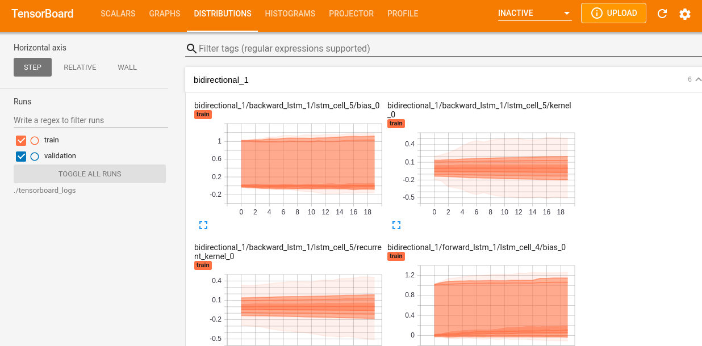
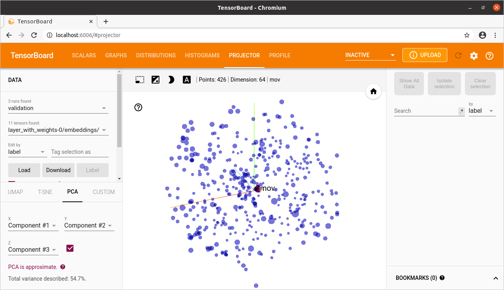

This model is trained with text=caller-callee-disassembly and label=function-return-type

clone the rep into /home/user/git
 
Then run these commands, and you got a trained model.
 
All done with tf-nightly2.5
 

The "/home/user/ret_type_basedir" directory you can choose by yourself, it will be
created if not exist.

<pre><code>
-l=1000   The output text will be maximum this value, bigger ones will be discarded.  
			This option is for smaller GPU setups. If you got e.g. CPU-only use ~300-1000,  for e.g. 8xV100 use 200000. 
			Default is 200000 
-e=2	  The number of epochs it should train. Default: 1
</code></pre>
 

<pre><code>
python3 build_return_type_dataset.py -b=/home/user/ret_type_basedir -l=1000
</code></pre>
 

<pre><code>
python3 build_ret_type__vocab_seq_len.py -b=/home/user/ret_type_basedir
</code></pre>
 

<pre><code>
python3 build_balanced_dataset.py -b=/home/user/ret_type_basedir
</code></pre>
 

<pre><code>
python3 build_balanced_ret_type__vocab_seq_len.py -b=/home/user/ret_type_basedir
</code></pre>
 

<pre><code>
python3 transform_ret_type_to_int.py -b=/home/user/ret_type_basedir
</code></pre>
 

<pre><code>
python3 train_return_type_model_lstm.py -b=/home/user/ret_type_basedir -e=2
</code></pre>
 

# Tensorboard
Run in console
<pre><code>
tensorboard --logdir=/home/user/ret_type_basedir/tensorboard_logs
</code></pre>
 

For tensorboard projector load files from /home/user/ret_type_basedir/tensorboard_logs/trained_word_embeddings

# Run with n1-standard-16(16vCPUs,60GB RAM)  8xV100 Tesla GPU
Adapting to TextVectorization takes ~1hour-15minutes

18336/18336 [==============================] - 6410s 350ms/step - loss: 1.8419 - accuracy: 0.4254 - val_loss: 1.9861 - val_accuracy: 0.3827
Epoch 2/2
18336/18336 [==============================] - 6301s 344ms/step - loss: 1.7016 - accuracy: 0.4575 - val_loss: 1.9310 - val_accuracy: 0.3680
2087/2087 [==============================] - 251s 121ms/step - loss: 1.7852 - accuracy: 0.4545
Loss:  1.785247802734375
Accuracy:  0.4544600546360016
Saving trained word embeddings (meta.tsv,vecs.tsv) (usable in tensorboard->Projector)
10 vocab words >['', '[UNK]', '%', 'null', ',', 'x', '1', '(', ')', 'mov']<
Shape of the weigths >(1464, 8)<

## run with balanced dataset
Epoch 65/70
8/8 [==============================] - 1s 171ms/step - loss: 0.6529 - accuracy: 0.8142 - val_loss: 0.4815 - val_accuracy: 0.8204
Epoch 66/70
8/8 [==============================] - 1s 171ms/step - loss: 0.6731 - accuracy: 0.8091 - val_loss: 0.4308 - val_accuracy: 0.8802
Epoch 67/70
8/8 [==============================] - 1s 171ms/step - loss: 0.6122 - accuracy: 0.8299 - val_loss: 0.4139 - val_accuracy: 0.8862
Epoch 68/70
8/8 [==============================] - 1s 170ms/step - loss: 0.6227 - accuracy: 0.8352 - val_loss: 0.4392 - val_accuracy: 0.8743
Epoch 69/70
8/8 [==============================] - 1s 171ms/step - loss: 0.5487 - accuracy: 0.8544 - val_loss: 0.3485 - val_accuracy: 0.8982
WARNING:absl:Found untraced functions such as forward_lstm_layer_call_fn, forward_lstm_layer_call_and_return_conditional_losses, backward_lstm_layer_call_fn, backward
_lstm_layer_call_and_return_conditional_losses, forward_lstm_1_layer_call_fn while saving (showing 5 of 40). These functions will not be directly callable after loadi
ng.
Epoch 70/70
8/8 [==============================] - 1s 171ms/step - loss: 0.5683 - accuracy: 0.8518 - val_loss: 0.5517 - val_accuracy: 0.8563
WARNING:absl:Found untraced functions such as forward_lstm_layer_call_fn, forward_lstm_layer_call_and_return_conditional_losses, backward_lstm_layer_call_fn, backward
_lstm_layer_call_and_return_conditional_losses, forward_lstm_1_layer_call_fn while saving (showing 5 of 40). These functions will not be directly callable after loadi
ng.
2/2 [==============================] - 0s 53ms/step - loss: 0.4126 - accuracy: 0.8598
Loss:  0.41262561082839966
Accuracy:  0.8597561120986938
Saving trained word embeddings (meta.tsv,vecs.tsv)             (usable in tensorboard->Projector, use chromium-browser to see it correctly,firefox does not always wor
k)
10 vocab words >['', '[UNK]', '%', 'null', ',', 'x', 'mov', '1', ')', '(']<
Building vectors.tsv file, use tensorboard->projector with chromium-browser
Building metadata.tsv file, use tensorboard->projector with chromium-browser

